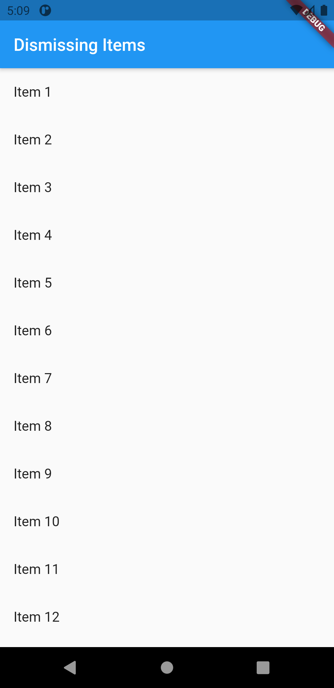
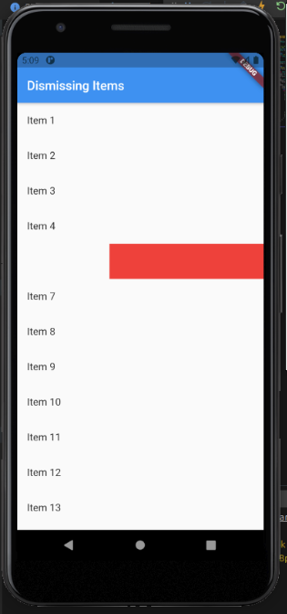
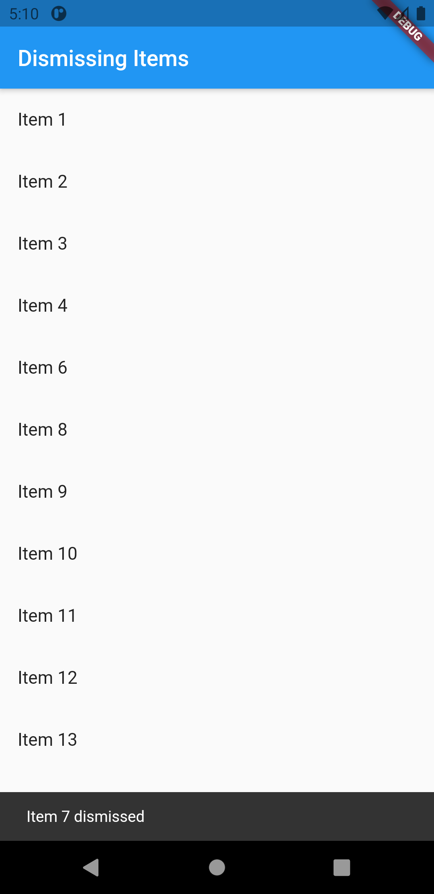

# dismiss_swipe

1. Create a list of items
Create a data source
Convert the data source into a list
2. Wrap each item in a Dismissible widget
3. Provide “leave behind” indicators

<table>
  <tr>
    <td>Output</td>
    <td>Swipe</td>
     <td>Deleted</td>
  </tr>
  <tr>
    <td></td>
     <td></td>
    <td></td>
 
  </tr>
 </table>